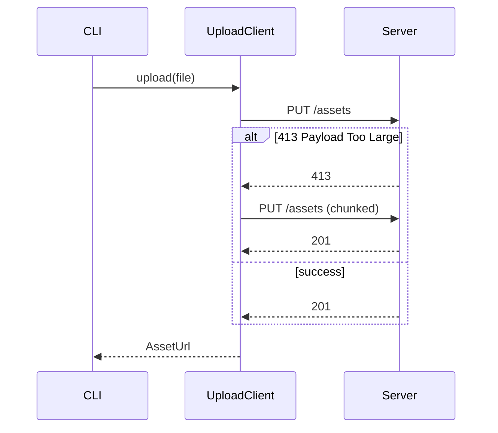

# PR body guide

Select optional sections based on reviewer needs. Keep descriptions grounded in actual changes made. For small local changes, supply the summary, issue reference, and verification command output.

## Organization template

The pull request body follows `.github/PULL_REQUEST_TEMPLATE.md`:

## What the hell did you do?

Lead with the problem or capability, then state the concrete mechanism and design reasoning.

```markdown
## What the Hell Did You Do?

Uploads exceeding 10MB failed silently because the client dropped the response body on HTTP 413. This surfaces `PayloadTooLargeError` to callers in `src/upload/client.ts` and retries once using chunked transfer.

Stacked on #480; only the last two commits belong to this PR.
```

### The blast radius (change map)

Use when changes touch several modules or shift responsibility between boundaries. Group rows by module, component, or boundary path in `src/`.

```markdown
### The Blast Radius

| Module | Before | After | Description |
| --- | --- | --- | --- |
| `src/upload/client.ts` | Dropped non-2xx responses | Maps 413 to `PayloadTooLargeError`, retries once chunked | Callers distinguish payload size limits from network drops |
| `src/cli/commands/upload.ts` | Output generic failure string | Outputs mapped error message and recovery suggestions | Actionable error output for terminal users |
```

When directory structure itself changes, provide a layout tree:

```text
src/
├── routes/      # accept and validate input
├── domain/      # own business rules and invariants
└── adapters/    # integrate external services
```

### How it actually works (architecture & behavior)

Include a Mermaid diagram when call order, async handling, retries, or state transitions changed. Tie node names to real symbols and label arrows with events or payloads.

For bug fixes, show Before and After diagrams at matching abstraction levels, naming the specific edge that changed.



For changes without runtime flow alterations, state: `Flow unchanged: updates configuration constants in src/config/.`

### What could break? (boundaries & risks)

Include when changes introduce failure modes, boundary invariants, database schema shifts, or external effects.

```markdown
### What Could Break?

| Invariant or boundary | Failure mode | Guard | Evidence or gap |
| --- | --- | --- | --- |
| Retry executes at most once | Infinite loop on continuous 413 | `attempt` counter capped at 1 in `src/upload/client.ts` | `tests/unit/upload.test.ts` passes |
| Chunked upload is idempotent | Duplicate assets created on retry | Server dedupes using SHA-256 payload hash | Not verified in this PR |
```

Inspect these areas when drafting: input validation and permissions; failure mapping, retries, duplicates, concurrency, ordering, and cleanup; schema migrations and rollbacks; credential exposure in logs or error messages; UI loading, error, empty, and repeated-action states.

Label unverified boundary conditions explicitly as `Not verified`.

### Next steps (rollout & gaps)

List database migrations, feature flags, rollout phases, or known follow-up PRs. State whether any item blocks merging.

## Which issue is this supposed to fix?

Link originating issues directly using GitHub closing syntax:

```markdown
## Which Issue is This Supposed to Fix?

Closes #482
```

## Where is the proof?

Provide exact commands executed and terminal output summaries.

````markdown
## Where is the Proof?

Verification commands run locally:

```bash
bun run check -- --format=agent
bun run typecheck
bun test tests/unit/upload.test.ts
```
````

Output summary:

- Biome check passed with 0 errors and 0 warnings.
- TypeScript compilation passed with 0 errors.
- `tests/unit/upload.test.ts`: 4 passed, 0 failed.

````

For UI changes, add visual evidence tables pointing to `.data/pr-shots/`:

```markdown
### Visual Evidence

| Before | After |
| --- | --- |
|  |  |
| Upload dialog, 1440x900, dark | Upload dialog, 1440x900, dark |
````

Use `Absent` for newly added states and `Removed` for deleted states.

## The "Am I Ready to Merge?" Checklist

Run checks to satisfy all items before submission. Check off every box (`- [x]`):

```markdown
## The "Am I Ready to Merge?" Checklist

- [x] I didn't push directly to `main` (if you did, close this immediately).
- [x] I removed all my `console.log("here")` and dead commented code.
- [x] It builds locally without throwing any errors or warnings.
- [x] I've given this a quick once-over to save myself from future embarrassment.
- [x] I am mentally prepared to fix whatever this breaks in production.

---

_By submitting this pull request, I accept that my code will be judged, refactored, or completely rewritten if it looks like spaghetti._
```
